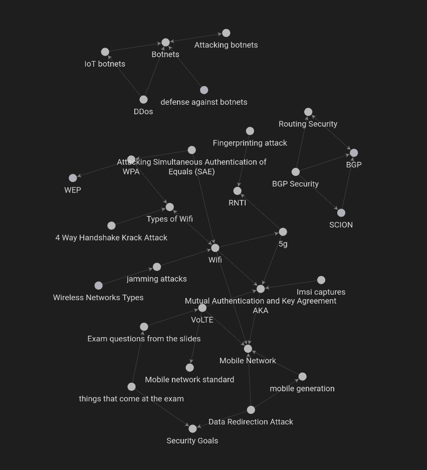

# Advanced Network Security notes

Here are the notes I took for a course at Radboud University called Advanced Network Security.

The main topics are: 

- [Mobile Networks](Mobile%20Network.md)
- [Wifi](WiFi.md)
- [Bot Nets](Botnets.md)
- [Routing Security](Routing%20Security.md)

The notes are also a network:

Best viewed in [Obsidian](https://obsidian.md).
